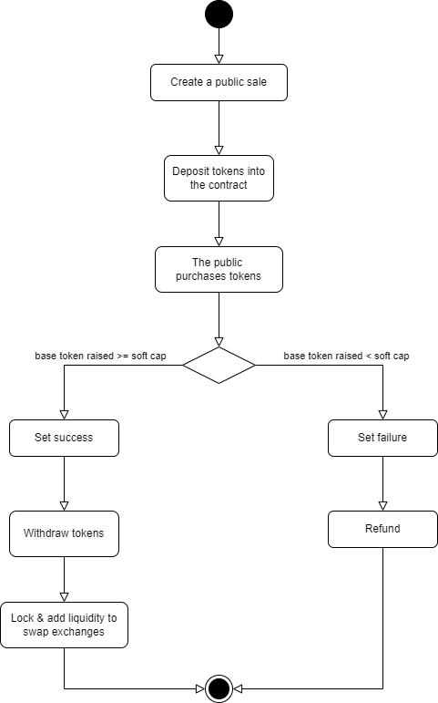

# 🚀 Public Sale Smart Contract
## ▶️ Flow


## 💡 Features
+ **Token Management:** Handle deposits, and manage tokens throughout the public sale lifecycle.
+ **Token Claim:** Participants can claim their tokens after the public sale concludes successfully.
+ **Cancel:** Allows the owner to cancel the public sale, enabling refunds under certain conditions.
+ **Refunds:** Offers a refund mechanism for participants if the public sale does not reach its soft cap or is cancelled.
+ **Hard Cap and Soft Cap:** Define minimum and maximum funding goals to steer the public sale's success criteria.
+ **Timed Rounds:** public sale starts and ends are strictly timed – no contributions outside this window.
+ **Automatic Liquidity Allocation:** A predefined portion of the funds raised is automatically converted into liquidity and added to UniswapV2.

## 💻 Installing
Run the commands: 
```
npm install
```