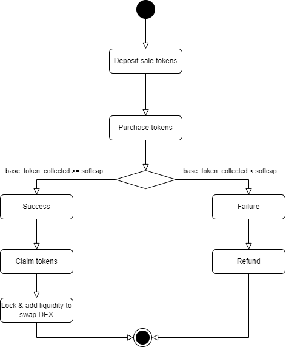

# 🚀 Public Sale Smart Contract
## Prerequisites
+ NodeJS version ^v18.  
## ▶️ Flow


## 💡 Features
+ **Token Management:** Handle deposits, and manage tokens throughout the public sale lifecycle.
+ **Token Claim:** Participants can claim their tokens after the public sale concludes successfully.
+ **Cancel:** Allows the owner to cancel the public sale, enabling refunds under certain conditions.
+ **Refunds:** Offers a refund mechanism for participants if the public sale does not reach its soft cap or is cancelled.
+ **Hard Cap and Soft Cap:** Define minimum and maximum funding goals to steer the public sale's success criteria.
+ **Timed Rounds:** public sale starts and ends are strictly timed – no contributions outside this window.

## 💻 Installing and Running 
### Clone the repository 
```
git clone https://github.com/linhtt-smartosc/public-sale-homework.git
```
### Install dependencies
Run the command to install all dependencies: 
```
npm install
```
### Compile the smart contracts 
Run the command to compile the smart contracts: 
```
npx hardhat compile
```
### Run the tests
Run the command to run the tests: 
``` 
npx hardhat test
```
